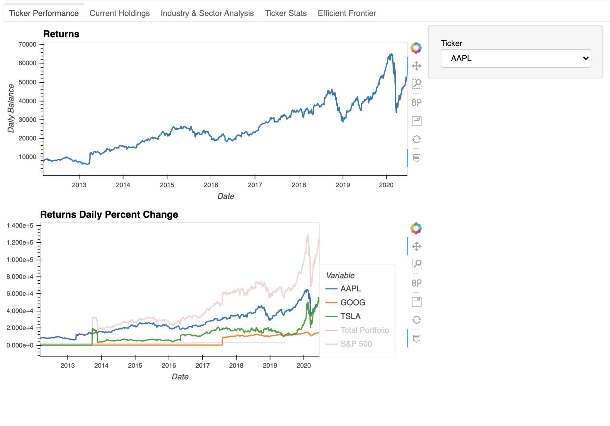

# Project "Show Me The Money"
## Project Abstract
The purpose of this project is to create a tool that assesses the strength of a portfolio based on the metrics of the performances of the given stocks over time as well as individual stock and industry weighting within the portfolio. This project also seeks to serve as predictive and instructive tool regarding how the user can optimize their portfolio.

## Establishing the Inputs
In order to effectively assess the strength of the portfolio, we take as an input two datasets. The first is a dataframe of the portfolio that gives us the ticker names, the date of an action take, whether the action taken is buy or sell, the number of shares bought or sold, as well as the transaction price of that purchase or sale.

## Pulling the data
The second input comes from the data we pull from the Financial Modeleing Prep API. This data pull comes with a number of different data points for each ticker within the portfolio. So we manipulate the data to optain the closing prices for the tickers (in this portfolio's case AAPL, GOOGL, and TSLA), and the result is a dataframe with the closing dates and prices for each ticker for the last 8 years or so. We do this so that we have closing prices for every day since the first portfolio transaction was made for each ticker.

## Calculating the Performance
After establishing both inputs, we calculate the performance by combining the two input dataframes so that the actions taken within the portfolio are within the same dataframe as the individual closing prices. We then write a function that allows us to display the number of shares the user has per ticker on any given day within the last 8 years. We calculate this using the number of total shares held from the previous action day. This allows us to calculate and plot the balances and returns for each ticker:

The second image allows comparison to the sp500 index

## Sector and Industry Analysis
In this section we focus on the users holdings and values by sector and industry. Once again, we manipulate the pulled data from the API to narrow doen the sector and industry for each ticker within the portfolio. We take the cumulative shares over the life of the portfolio thus far and using the buy/sell amounts from the input portfolio, we derive contributions and values by sector and industry. The following images show the holdings and the breakdown of the portfolio's contributions and current values by industry an sector:

Furthermore, we use the pulled data that we have manipulated and broken down to diplay the stats of each ticker in the portfolio. These stats include the betas, PE ratios, and the most recent dividends:

## Portfolio Optimization
In this final section, we use a few methods to promote portfolio optimization. Here we borrowed some source code from Prateek Singh's Github.[^1] We simulate the portfolio for thousands of possible allocations and get the log returns which are displayed below: 

From here we do a single run for a random allocation on the portfolio and we obtain an expected portfolio return and volatility as well as the sharpe ratio. This allows us to run a Monte Carlo simulation and plot the results:

With the Monte Carlo simulation we use the Efficient Frontier as a means to show how the portfolio can be optimized. This method uses the curve of the Monte Carlo to indicate how the portfolio can be optimized for performance with minimal risk. See the below plot:

## In Conclusion
The final form of the code in the project was not what we would call "agnostic," meaning that in order for the code to work by just inserting the two inputs, we would need to reformat the code so that no matter what input was given, the output would run smoothly. Other than this obvious issue, overall this is the start of what we consider to be thorough portfolio analysis and optimization. We look forward to how we can build on this tool and value any input for its improvement. 

 
[^1]: https://github.com/PrateekKumarSingh/Python/blob/master/Python%20for%20Finance/Python-for-Finance-Repo-master/09-Python-Finance-Fundamentals/02-Portfolio-Optimization.ipynb