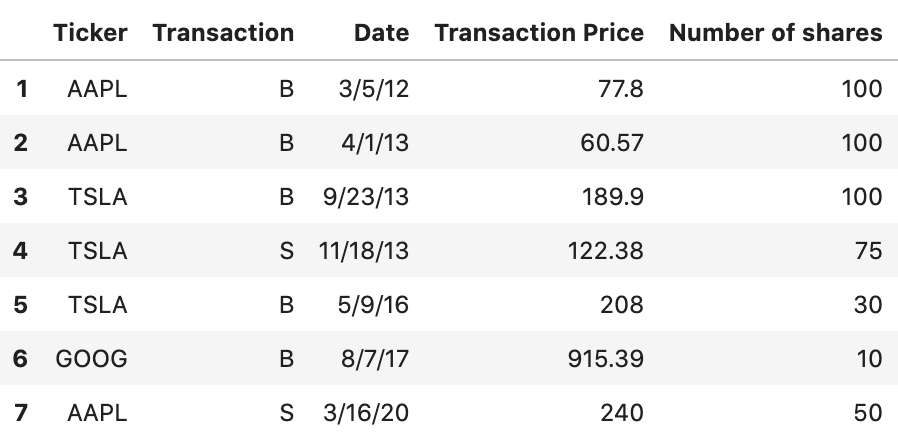
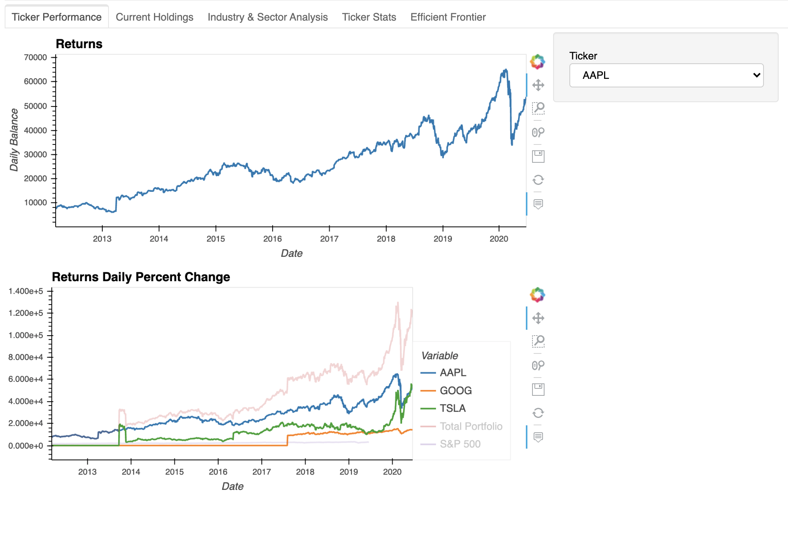
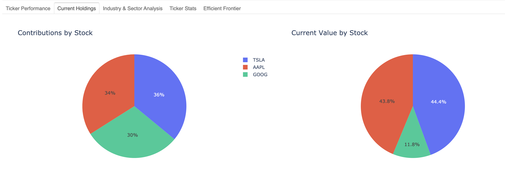
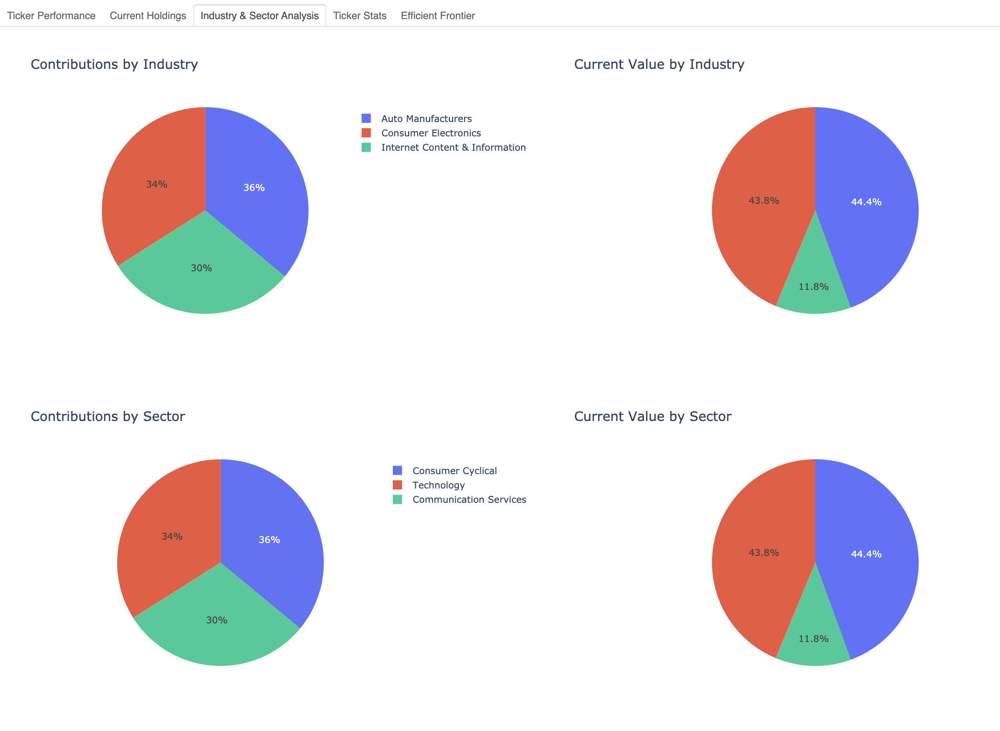
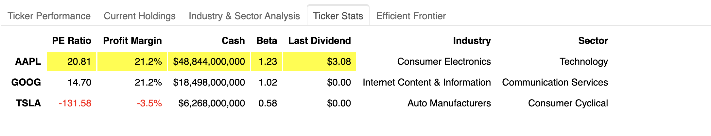
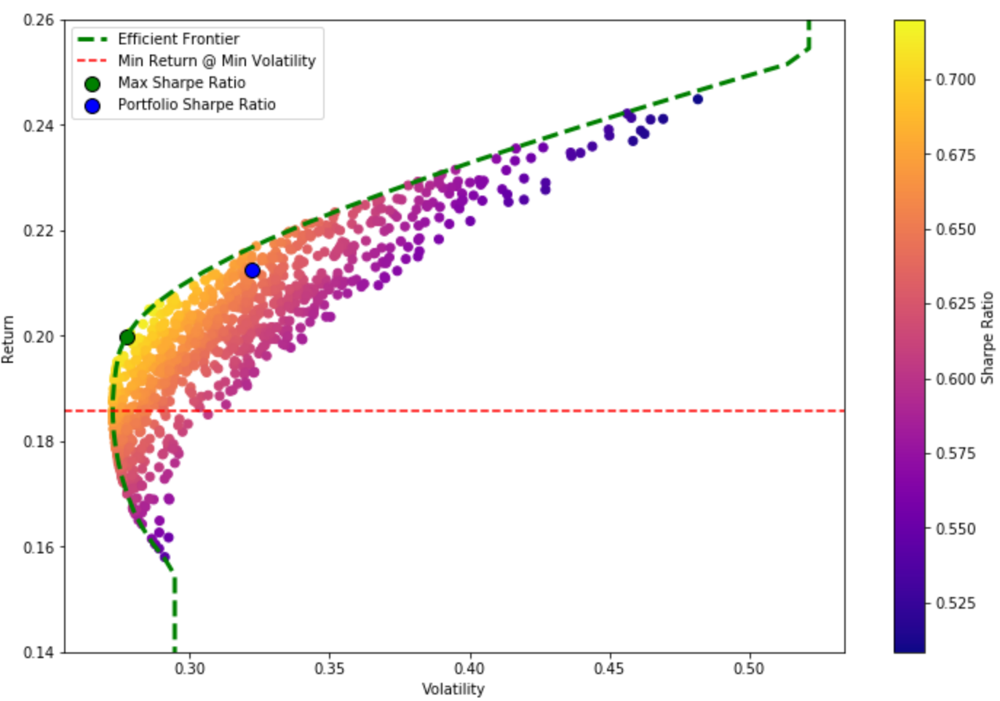

# Project "Show Me The Money"
Contributors:
* Heena Roy
* Renae Martinez
* Alex Cox

## Project Abstract
The purpose of this project is to create a tool that assesses the strength of a portfolio based on the metrics of the performances of the given stocks over time as well as individual stock and industry weighting within the portfolio. This project also seeks to serve as predictive and instructive tool regarding how the user can optimize their portfolio.

## Establishing the Inputs
In order to effectively assess the strength of the portfolio, we take as an input a CSV file containing the following transaction information:
- Ticker: Stock ticker that was purchased/sold
- Transaction: 'B' for buy; 'S' for sell
- Date: Date of the transaction
- Transaction Price: Price per share for the given transaction
- Number of shares: Number of shares per transaction
A sample input portfolio is shown below:

## Pulling the data
Based on the tickers represented in the input portfolio CSV file, the appropriate financial data is  pulled from the Financial Modeleing Prep API. Data of interest includes:
- PE Ratio
- Profit Margin
- Cash on Hand
- Beta
- Last Dividend
- Industry
- Sector
- Daily Closing Price (from the first purchase date to yesterday's closing date)

## Calculating the Performance
After establishing both inputs, we calculate the performance by combining the two input dataframes so that the actions taken within the portfolio are within the same dataframe as the individual closing prices. We then write a function that allows us to display the number of shares the user has per ticker on any given day within the last 8 years. We calculate this using the number of total shares held from the previous action day. This allows us to calculate and plot the balances and returns for each ticker:

The second image allows comparison to the S&P500 index

## Sector and Industry Analysis
In this section we focus on the users holdings and values by sector and industry. Once again, we manipulate the pulled data from the API to narrow down the sector and industry for each ticker within the portfolio. We take the cumulative shares over the life of the portfolio thus far and using the buy/sell amounts from the input portfolio, we derive contributions and values by sector and industry. The following images show the holdings and the breakdown of the portfolio's contributions and current values by industry and sector:

Furthermore, we used the pulled data that we have manipulated and broken down to display the status of each ticker in the portfolio. These stats include the betas, PE ratios, and the most recent dividends:

## Portfolio Optimization
We calculated the expected returns, volatilty, and sharpe ratio for the input portfolio and compared this to the Monte Carlo simulated returns based random weights assigned to each ticker in the initial input portfolio.  We utilized the efficient frontier source code from Prateek Singh's Github to assit with the analysis.[^1] Using Prateek Singh's code we were able to simulate the projected returns and overlay the Efficient Frontier curve for the simulated returns, volatility, and sharpe ratios.  We added the calculated max sharpe ratio, portfolio sharpe ratio and expected minimum return at the minimum voloatility indicators on the graph below. 

If the Portfolio's sharpe ratio falls below the red line (Min Return @ Min Volatility) then this indicates that the portfolio is taking on too much risk for the given return.  There exists multiple other portfolio weights that would offer greater returns for the given risk.  Any sharpe ratio above the red line is good; however, a sharpe ratio on the green Efficient Frontier line indicates that the portfolio is acheiving the max return for given the risk. 

## In Conclusion
The final form of the code in the project was not what we would call "agnostic," meaning that in order for the code to work by just providing an input portfolio CSV file, we would need to reformat the code so that no matter what input was given, the output would run smoothly. Other than this obvious issue, overall this is the start of what we consider to be thorough portfolio analysis and optimization. We look forward to how we can build on this tool and value any input for its improvement. 

 References
[^1]: https://github.com/PrateekKumarSingh/Python/blob/master/Python%20for%20Finance/Python-for-Finance-Repo-master/09-Python-Finance-Fundamentals/02-Portfolio-Optimization.ipynb